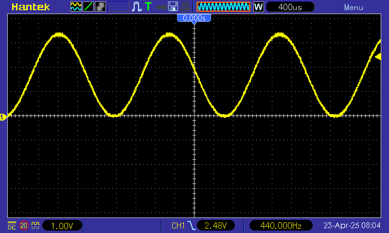
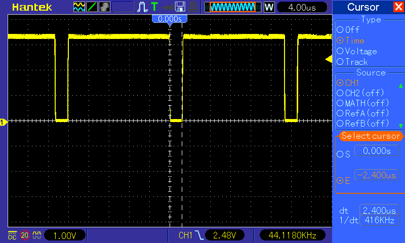

# arduino-r4-ra4m1-dac12-example
Arduino R4 RA4M1 Wave Generation with 12bit DAC and DMA

## RA4M1_DAC12_RegisterWrite
 This is a test code for sine wave generation via direct access to the 12-bit DAC registers. It is faster than analogWrite() in the standard library.

> Sampling rate : 44100Hz.  
> Sine wave frequency : 440Hz.

## RA4M1_DAC12_DMA
This is a test code for sine wave generation by kicking a 12-bit DAC with DMA. No interrupt processing is required, reduced CPU load.

> Sampling rate : 44100Hz  
> Sine wave frequency : 440Hz

---

Tested with XIAO RA4M1  

Generated wave

RA4M1_DAC12_RegisterWrite D1 output is :  
 LO=interrupt  
 HI=mainloop  

The duty of the D1 output indicates the load of interrupt processing. It is about 10% of the total.

